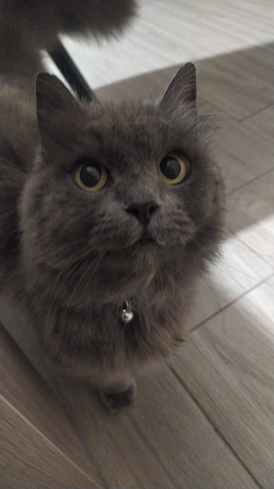

# La web de michi traviesa

_Está web ha sido construida con javascript vanilla y css_

Si quieres probarla en la siguiente palabra ------>[**Kitty**](https://pablodl10.github.io/MiHija/)

Si quieres informarte sobre gatos vete a la [Wikipedia](https://es.wikipedia.org/wiki/Felis_silvestris_catus)

## Mi hija


---

## Tipos de gatos :cat:
|Nombre    |    Pelaje      | Peso        |
|  ---     |:--------------:| ---         | 
|Persa     |  	Largo       | 2,3 a 6,8 kg|
|Siamés    |     Corto      | 2,5 a 4,5Kg |
|Savannah  |      Corto     | 3,2 a 11 kg |
|Azul ruso |     Corto      | 2,5 a 7 kg  |
|Balinés   |     Largo      | 3,6 a 5.4 kg|
|Maine Coon|     Largo      | 4,5 a 11 kg |
---

## Ventajas de tener un gato 


<ul>
<li>Se ha comprobado que tener un gato reduce el estrés.</li>
<li>Normalmente los dueños de gatos tienen una tensión arterial más baja que las personas sin mascotas.</li>
<li>Puedes beneficiarte de un sistema inmunológico más fuerte y recuperarte de las enfermedades antes que las personas que no tienen animales de compañía.</li>
<li>Por lo general, los niños que crecen con gatos tienen menos días de enfermedad que aquellos que no tienen mascotas.</li>
<li>Los gatos son muy cariñosos y tienen un gran carácter, pero también valoramos su independencia, es decir, necesitan menos cuidados que otras mascotas.</li>
<li>Los gatos pueden ayudar a las personas a recuperarse más rápido de un trauma emocional, como el fallecimiento de un ser querido.</li>

---

## Datos de los Gatos

- [x] Son bonitos
- [x] Son cariñosos
- [x] Son comilones
- [ ] Son muy agresivos
- [ ] Son poco juguetones

---

```java
<!DOCTYPE html>
<html lang="en">
<head>
    <meta charset="UTF-8">
    <meta http-equiv="X-UA-Compatible" content="IE=edge">
    <meta name="viewport" content="width=device-width, initial-scale=1.0">
    <title>Mi hija</title>
    <style>
        .container{
            display:flex;
            flex-direction: row;
            gap: 10px;
        }
        .container img{
            width: 100px;
            border-radius: 10px;
            box-shadow: rgba(0, 0, 0, 0.35) 0px 5px 15px;
        }
        h2{
            background: #CF1D11;
background: linear-gradient(to right, #CF1D11 0%, #278CCF 19%);
-webkit-background-clip: text;
-webkit-text-fill-color: transparent;
        }
    </style>
</head>
<body>
    <h2>Michiiiiiii</h2>
    <div class="container">
        
        
        
        
    </div>
    
</body>
</html>
```
---

Por ultimo nombrar a nuestro profe (@Kant003) ~~que para nada este paso es obligado~~

